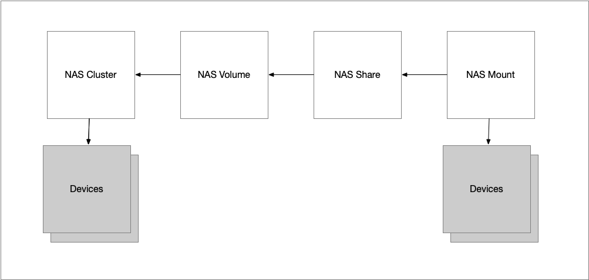

## netbox-nas

A plugin to enable managment of NAS resources.

This plugin introduces four new models:
  - NAS Cluster: The NAS resource provider, e.g. a NAS head node or cluster of nodes. NetBox Devices can be linked to this.
  - NAS Volume: The share backing volume used by the NAS cluster.
  - NAS Share: The share itself, e.g. NFS export, CIFS share, CephFS path, etc.
  - NAS Mount: The mount definition. This describes how a share should be mounted on a particular resource. NetBox Devices, Virtual Machines, and Prefixes can be linked to this currently.

## Requirements
Minimum NetBox version:
  - v1.0.3: NetBox 3.7.8
  - v1.0.2: NetBox 4.0.0
  - v1.0.1: NetBox 3.4.0
  - v1.0.0: NetBox 3.4.0
